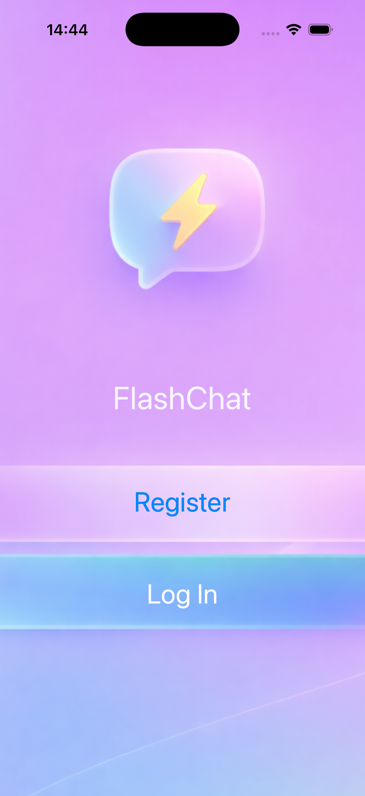
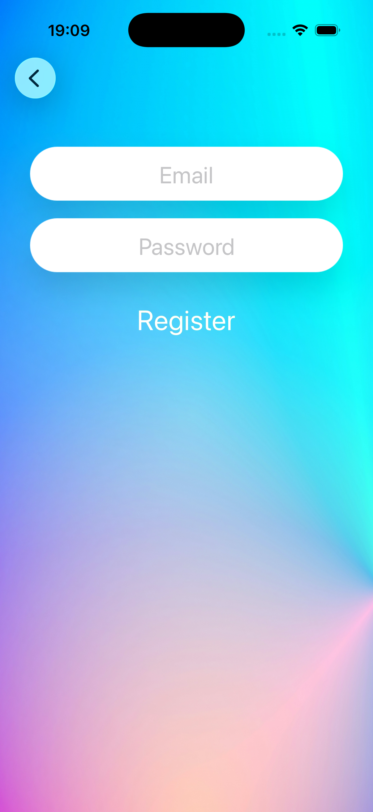
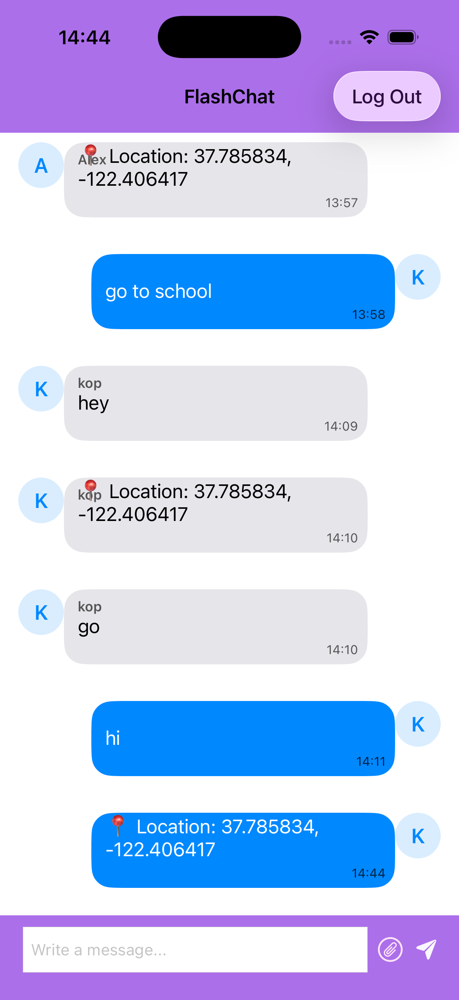
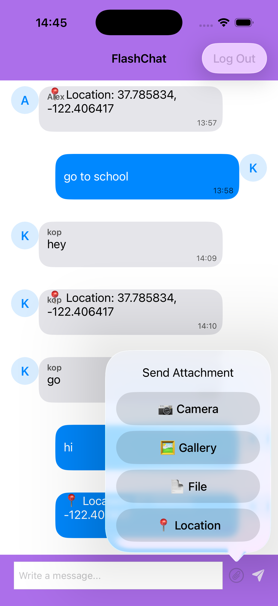

# 🚀 FlashChat iOS

A production-style real-time chat application built with **Swift**, **UIKit**, **Firebase**, **MVVM architecture**, and **Dependency Injection**.

The project demonstrates real-time messaging, Firebase Authentication, Cloud Firestore integration, protocol-based service abstraction, testable ViewModels, and unit testing with mock services.

---

## 📱 Demo


> Real-time messaging, attachments, and smooth UI interactions.

---

## ✨ Features

- 🔐 Authentication: login and registration via Firebase Auth
- 💬 Real-time messaging with Cloud Firestore listener
- 🧠 MVVM architecture
- 🔌 Dependency Injection using protocols
- 🧪 Unit testing with mock services
- 🖼 Custom message cells for incoming and outgoing messages
- 👤 Avatar generation based on username initials
- 🕒 Message timestamps
- 📜 Auto-scroll to the latest message
- ⌨️ Smooth keyboard handling with constraints
- 📱 UIKit-based responsive interface

### 📎 Attachments

- 📷 Camera
- 🖼 Photo Library
- 📄 Files
- 📍 Location UI

---

## 📸 Screenshots

### 🚀 Welcome Screen



### 🔐 Login Screen


### 📝 Register Screen



### 💬 Chat Screen



### 📎 Attachment Menu



---

## 🛠 Tech Stack

- Swift
- UIKit
- Firebase Authentication
- Cloud Firestore
- Swift Package Manager
- MVVM Architecture
- Dependency Injection
- Swift Testing
- Auto Layout
- UITableView
- Git & GitHub

---

## 🧪 Testing

The project includes **10 unit tests** for ViewModels and business logic.

### LoginViewModel Tests

- Empty email validation
- Empty password validation
- Successful login flow

### RegisterViewModel Tests

- Empty name validation
- Empty email validation
- Empty password validation

### ChatViewModel Tests

- Message listener updates message count
- Current user message detection
- Other user message detection
- Empty message validation

### Mock Services

The test suite uses:

- `MockAuthService`
- `MockChatService`

This allows ViewModels to be tested independently from Firebase and network dependencies.

---

## 🧱 Architecture

The project follows **MVVM (Model-View-ViewModel)**.

### Architecture Flow

```text
ViewController
      ↓
ViewModel
      ↓
Services
      ↓
Firebase
```

### Architecture Diagram

```text
┌───────────────┐
│ ViewController│
└───────┬───────┘
        ↓
┌───────────────┐
│   ViewModel   │
└───────┬───────┘
        ↓
┌───────────────┐
│   Services    │
│ Auth / Chat   │
└───────┬───────┘
        ↓
┌───────────────┐
│   Firebase    │
│ Auth + DB     │
└───────────────┘
```

### Why MVVM?

- Separates UI from business logic
- Improves testability
- Makes the code scalable
- Reduces ViewController complexity

### ViewControllers

Responsible for:

- UI rendering
- User interactions
- Navigation
- Binding with ViewModels

### ViewModels

Responsible for:

- Input validation
- Presentation logic
- Authentication flow
- Chat logic
- Communication with services

### Models

Responsible for representing app data structures, such as chat messages.

### Services

Responsible for Firebase communication:

- Authentication
- Firestore message loading
- Firestore message sending
- User profile fetching

---

## 🔌 Dependency Injection

Services are injected into ViewModels through protocols.

### Protocols

- `AuthServicing`
- `ChatServicing`

### Production Services

- `AuthService`
- `ChatService`

### Test Services

- `MockAuthService`
- `MockChatService`

This improves testability, maintainability, and separation of concerns.

---

## 🔥 Firebase Integration

The application uses Firebase for:

### Authentication

- User registration
- User login
- User logout

### Cloud Firestore

- Real-time message storage
- Real-time message updates
- User profile data
- Sender name support

---

## 🔄 App Flow

```text
Welcome Screen
      ↓
Login / Register
      ↓
Firebase Authentication
      ↓
Chat Screen
      ↓
Send / Receive Messages in Real Time
```

---

## ⚙️ Technical Highlights

- Real-time updates using Firestore listeners
- Asynchronous data handling via closures
- Clean separation of layers with MVVM
- Safe UI updates on the main thread
- Dynamic UITableView with reusable cells
- Keyboard-aware layout using constraints
- Custom avatar generation without backend images
- Protocol-based Dependency Injection
- Unit testing with mock services

---

## 🧪 Challenges & Solutions

### Real-time UI Synchronization

**Challenge:** Avoid UI glitches during message updates.

**Solution:**

- Firestore listener
- Safe reload logic
- Scroll-to-bottom handling after updates

### Auto-scroll Stability

**Challenge:** Avoid crashes when scrolling after table reloads.

**Solution:**

- Section and row validation
- Delayed scrolling with `DispatchQueue.main.async`

### Keyboard Handling

**Challenge:** Prevent the keyboard from overlapping the input field.

**Solution:**

- Observed keyboard notifications
- Adjusted bottom constraint dynamically

### Avatar Generation

**Challenge:** Display user identity without stored profile images.

**Solution:**

- Generated avatars from username initials

---

## 📌 Current Status

✅ MVP Completed

Implemented:

- Firebase Authentication: Login / Register / Logout
- Firestore real-time messaging
- Chat UI with custom cells
- Attachment menu UI
- Keyboard handling
- Auto-scroll
- MVVM architecture
- Dependency Injection
- Unit tests with mock services

---

## 📂 Project Structure

```text
FlashChatIOS
├── Models
├── Services
├── ViewModels
├── ViewControllers
├── Views
├── SupportingFiles
├── FlashChatIOSTests
├── Assets
└── Screenshots
```

---

## ⚙️ Setup

Clone the repository:

```bash
git clone https://github.com/swiftio116/flashchat-ios.git
cd flashchat-ios
```

Open the project:

```bash
open FlashChatIOS.xcodeproj
```

Add your Firebase configuration file:

```text
GoogleService-Info.plist
```

Run the project in Xcode.

---

## 📚 What I Learned

- Working with Firebase Authentication
- Working with Cloud Firestore real-time updates
- Applying MVVM architecture in UIKit
- Using Dependency Injection through protocols
- Writing unit tests with mock services
- Separating ViewController logic from business logic
- Building reusable custom UITableView cells
- Handling keyboard-driven layout changes
- Managing Git and GitHub workflow

---

## 🎯 My Contribution

- Designed chat UI and message cell layout
- Refactored the project to MVVM architecture
- Implemented Firestore real-time listener
- Built keyboard-aware input system
- Added attachment menu UI
- Implemented auto-scroll and smooth UX behavior
- Added Dependency Injection for Auth and Chat services
- Added unit tests for Login, Register, and Chat ViewModels

---

## 📌 Future Improvements

- ✔ Read receipts
- 🖼 Media upload with Firebase Storage
- 👥 Group chats
- 🟢 Online / offline status
- 🔔 Push notifications
- 📎 Image sharing
- 📱 SwiftUI migration

---

## 👨‍💻 Author

**Aiaz Muzafarov**

- GitHub: [swiftio116](https://github.com/swiftio116)
- LinkedIn: [Aiaz Muzafarov](https://www.linkedin.com/in/aiaz-muzafarov-546a4a288)
