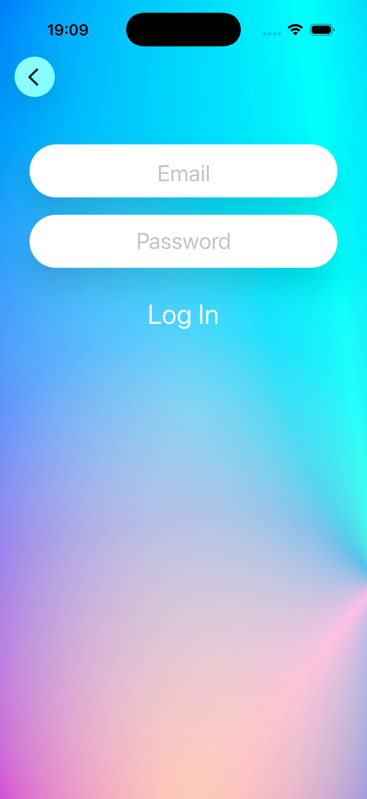
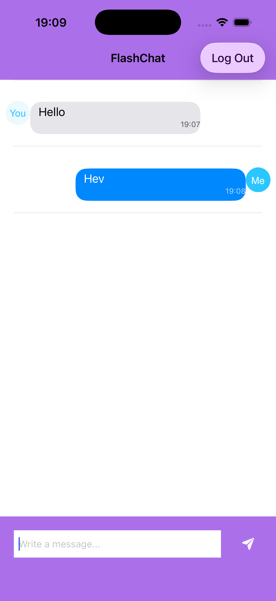

🚀 FlashChat iOS

A production-style real-time chat application built with Swift, UIKit, and Firebase.

The project demonstrates clean architecture, real-time data synchronization, and UX patterns inspired by modern messaging apps like Telegram.

⸻

📱 Demo

✨ Features

* 🔐 Authentication (Login / Register via Firebase Auth)
* 💬 Real-time messaging (Firestore listener)
* 🧠 MVVM architecture
* 🖼 Custom message cells (incoming / outgoing)
* 👤 Avatar generation based on username initials
* 🕒 Message timestamps
* 📜 Auto-scroll to latest message
* ⌨️ Smooth keyboard handling (constraint-based)
* 📎 Attachment menu:
    * Camera
    * Photo Library
    * Files
    * Location (UI ready)
* 🚪 Logout

⸻

🧱 Architecture

The project follows MVVM (Model-View-ViewModel):
ViewController → ViewModel → Services → Firebase

Architecture Diagram
┌───────────────┐
│ ViewController│
└───────┬───────┘
        ↓
┌───────────────┐
│   ViewModel   │
└───────┬───────┘
        ↓
┌───────────────┐
│   Services    │
│ Auth / Chat   │
└───────┬───────┘
        ↓
┌───────────────┐
│   Firebase    │
│ Auth + DB     │
└───────────────┘

Why MVVM?

* Separates UI from business logic
* Improves testability
* Makes the code scalable
* Reduces ViewController complexity

⸻

🔄 App Flow

Login / Register
        ↓
   Authentication
        ↓
   Chat Screen
        ↓
Send / Receive Messages (Realtime)

⚙️ Technical Highlights

* Real-time updates using Firestore listeners
* Asynchronous data handling via closures
* Clean separation of layers (MVVM)
* Safe UI updates on main thread
* Dynamic UITableView with reusable cells
* Keyboard-aware layout using constraints
* Custom avatar generation without backend images

📸 Screenshots
Chat UI
### 🚀 Welcome Screen

### 🔐 Login Screen

### 📝 Register Screen

### 💬 Chat Screen

### 📎 Attachment Menu

⸻

🧪 Challenges & Solutions

1. Real-time UI synchronization

Challenge: Avoid UI glitches during updates
Solution:

* Firestore listener
* Safe reload + scroll logic

⸻

2. Auto-scroll stability

Challenge: Crashes when scrolling after reload
Solution:

* Section/row validation
* Delayed scroll via DispatchQueue.main.async

⸻

3. Keyboard handling

Challenge: Keyboard overlapping input field
Solution:

* Observed keyboard notifications
* Adjusted bottom constraint dynamically

⸻

4. Missing user avatars

Challenge: No stored profile images
Solution:

* Generated avatars from initials (CoreGraphics)

⸻

📈 Project Evolution
v1.0 → Basic chat (MVC)
v1.1 → Refactored to MVVM
v1.2 → Firebase integration
v1.3 → UI/UX improvements
v1.4 → Attachment menu

⸻

📌 Current Status

✅ MVP Completed

The application supports:

* authentication
* real-time messaging
* production-like UI

⸻

🔮 Future Improvements

* ✔ Read receipts (✓ / ✓✓)
* 🖼 Media upload (Firebase Storage)
* 👥 Group chats
* 🟢 Online/offline status
* 🔔 Push notifications

⸻

🛠 Tech Stack

* Swift
* UIKit
* Firebase Auth
* Firebase Firestore
* MVVM
* Auto Layout
* UITableView

⸻

🔧 Setup
git clone https://github.com/swiftio116/flashchat-ios.git
cd flashchat-ios
pod install

Open .xcworkspace

Add your Firebase config:

* Replace GoogleService-Info.plist

Run 🚀

⸻

🎯 What I Learned

* Designing scalable architecture (MVVM)
* Working with real-time data (Firestore)
* Handling async operations safely
* Building responsive UI (keyboard + layout)
* Structuring production-like iOS projects

⸻

👤 Author

Aiaz

* GitHub: https://github.com/swiftio116
* LinkedIn: https://www.linkedin.com/in/aiaz-muzafarov-546a4a288
